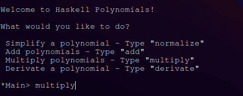
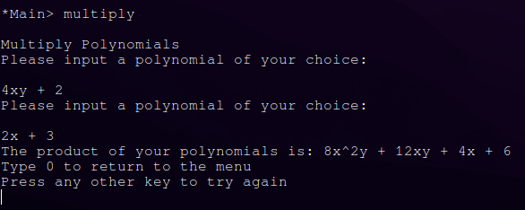

# PFL_TP1_G09_07
--------------------
First Project for the Course Programação Funcional e Lógica (PFL) @ Faculdade de Engenharia do Porto (FEUP)

# Representação Interna dos Polinómios

## Estrutura de Dados

Para este primeiro trabalho prático, decidimos utilizar a seguinte estrutura para representação dos nossos Polynomials:
```haskell
type Var = (Char, Integer) -- x^(-2) => ('x', -2)
type Mono = (Integer, [Var]) -- 5x^2y => (5, [('x',2), ('y', 1)])
type Poly = [Mono] -- 5x^2y - 2x => [(5, [('x',2), ('y', 1)]), (-2, [('x', 1)])
```
## Justificação

Decidimos utilizar esta estrutura de dados, pois pareceu-nos uma boa maneira de organizar um polinómio (lista de monómios), em que um monómio consiste num tuplo, em que o primeiro elemento será o coeficiente do mesmo e o segundo elemento é uma lista de tuplos no seguinte formato (variável, expoente).

Uma outra opção melhor seria por exemplo utilizar uma estrutura de àrvore binária para cada Poly, contudo acabamos por não optar por essa opção porque aquando do início deste projeto ainda não estavamos muito familiarizados com a utilização de b-trees em haskell.

<br>
Com esta estrutura de dados, a implementação das funções pode às vezes ficar um pouco nested, por exemplo aquando da iteração dos diferentes monómios, para aceder à lista de variáveis seria algo como snd (snd Poly).

##### Solução: 
Recorrer a funções auxiliar para manter uma boa legibilidade e compreensão do código.


# Funcionalidades

## Parse de 1 Polynomial - parsePoly :: String -> Poly

Para converter uma string para o nossa estrutura de dados de um polinómio e vice-versa, tivemos de utilizar bastantes funções, cada uma documentada no módulo PolyParser.
Todas estas funções foram agrupadas nas wrapper function descritas em baixo.

**nota** : Para utilizar expoentes negativos, é necessário utilizar parentesis
na string de input, por exemplo: x^(-2).

```haskell
-- Converts a String into a Polynomial
parsePoly :: String -> Poly
parsePoly [] = []
parsePoly s = remove_zeros (map (parseMonomial) (remove_plus (remove_mult (replacePattern ((simplify_minus (formatSpace s)))))))

-- Example: "1 - 1 + 3x^4 - 3x^4 + 12x^(-2) - 44z^(-2)y^4z^2" => [(1,[]),(-1,[]),(3,[('x',4)]),(-3,[('x',4)]),(12,[('x',-2)]),(-44,[('z',-2),('y',4),('z',2)])]

-- Converts a Polynomial back into a String
reverseParser :: Poly -> String
reverseParser l = handle_first_plus (intercalate " " (map (reverseMono) l))

-- Example: [(2,[]),(-3,[('x',4)]),(-5,[('y',4)])] => "- 3x^4 - 5y^4 + 2" (Ordered by maximum expoent and if it's equal by coefficient)
```

## Normalização de 1 Polynomial - simplify :: Poly -> Poly

Esta função agrupa para o mesmo polinómio todos os monoids que apresentam
o mesmo conjunto de variáveis, e adiciona os seus coeficientes.

```haskell
simplify' :: Poly -> Poly
simplify' [] = []
simplify' (x:xs) = [(fst x + vs, snd x)] ++ simplify' resto
    where 
        vs = sum (map (fst) ks)
        (ks, resto) =  partition (\y -> (lisEquals (snd x) (snd y) == True)) xs
```

## Adição de 2 Polynomials - addPoly :: Poly -> Poly -> Poly

Para a adição, reparamos que concatenando dois polinómios e utilizando a função simplify na resultante, obtiamos a soma dos mesmos, como tal, decidimos utilizar esta estratégia.

```haskell 
addPoly :: Poly -> Poly -> Poly 
addPoly xs ys = simplify (remove_exp_zero (remove_zeros( simplify' (xs ++ ys))))
```

## Multiplicação de 2 Polynomials - multiplyPoly :: Poly -> Poly -> Poly

Tomando partido da função: 
```haskell
-- Multiplies two monomials
multiply_monoid :: Mono -> Mono -> Mono
multiply_monoid x y = (coef, sumThem (variables))
  where   
    coef = (fst x) * (fst y)
    variables = (snd x) ++ (snd y)
```
Inicialmente pensamos que a melhor maneira de simular a propriedade distributiva implicita numa multiplicação de 2 Polynomials, seria fazer um nested loop. <br>
Porém, como em Haskell não existe o conceito de for loop, tivemos de ser um pouco mais criativos e fazer proveito da seguinte função que utiliza um concatMap e um map para aplica a propriedade distributiva a cada par de Monoids utilizando a função descrita em cima.
```haskell
-- Wrapper function to multiply two polynomials
multiplyPoly' :: Poly -> Poly -> Poly
multiplyPoly' l1 l2 = (remove_exp_zero (concatMap (\x -> map (\y -> multiply_monoid x y) l1) l2))
```
## Derive Polynomial - derive

Utilizing the function bellow, we extract the list of Var (e.g x^(-2)) that are that have the same variable has the Char chosen in the function, and apply the normal derivation process, multiplying the coefficient by the expoent and subtracting one from the expoent.

```haskell
derivePoly' :: Poly -> Char -> Poly
derivePoly' [] _ = []
derivePoly' (x:xs) c = (coef, (fst (to_derivePoly' equal), (snd (to_derivePoly' equal) - 1)) : diff) : derivePoly' xs c
  where 
    (equal, diff) = partition (\(a,b) -> (a == c)) (snd x)
    coef = (fst x) * ((snd (to_derivePoly' equal)))
```

## Exemplos de Utilização 

### Testing

Como interpretamos pelo enunciado que não poderiamos utilizar módulos de testing, como por exemplo **Test.QuickCheck**, implementamos alguns testes com suporte visual (por exemplo, qual a string original e a resultante) à mão para ser mais fácil
visualizar o funcionamento do programa sem necessidade de interação no ghci.

Todos os testes estão compilados na file [test.hs](test.hs).

### Interativade

Embora não fosse um dos objectivos, decidimos incluir uma simples interface que suporta o programa, que funciona, como exemplo, da seguinte maneira:

#### Menu Principal

  

#### Menu após escolha multiply

  


--------------------------
## Group Members: 

- Afonso Jorge Farroco Martins -  [up202005900@fe.up.pt](mailto:up202005900@fe.up.pt)  
- José Diogo Pinto,  [up202003529@fe.up.pt](mailto:up202003529@fe.up.pt)